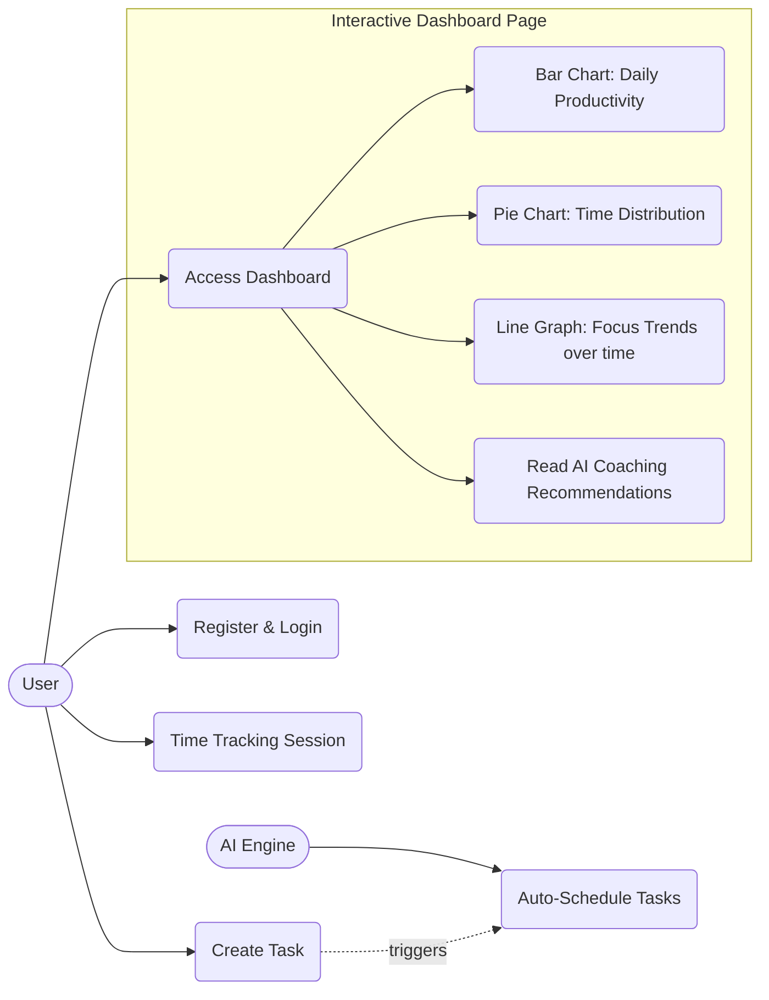
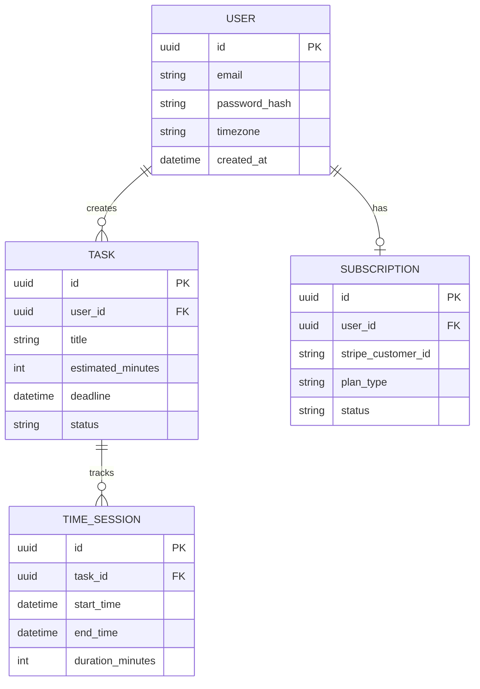

# REAL-WORLD PRODUCT MINDSET

> Assume this application will eventually become a commercial SaaS product. Every technical decision should be evaluated as if it will be maintained in production for years and used by thousands of users.
> 
> That single statement influences every architectural, security, deployment, and engineering decision the AI will make throughout the project.

This project is intended to become a real product used by real users.

I am fully prepared to invest in professional infrastructure whenever the project reaches the appropriate maturity level.

This includes, but is not limited to:

- Purchasing a custom domain
- Deploying production servers
- Paying for databases
- Purchasing cloud services
- Using paid APIs when necessary
- Buying monitoring services
- Purchasing email services
- Buying object storage
- Paying for authentication providers
- Paying for security services
- Paying for CDN services

Whenever you (the AI agent) believe the project has reached a stage where production deployment is beneficial, explicitly recommend it.

Do not postpone deployment until the end of the project.

Instead, identify the earliest stable version that should be deployed so the application can start receiving real users and continuous feedback.

Always think like a software company, not like a university project.

---

# DEVELOPMENT STARTUP

To start the full local development environment, run the following script from the project root:

```
start-dev.ps1 (Created & Verified)
```

This script will:
1. Start Docker containers (PostgreSQL on port 5432 + Redis on port 6379) via `docker compose up -d`
2. Start the Spring Boot backend on port 8080 via `mvn spring-boot:run`

> Maven must be installed and available on the system PATH before running this script.

---

# AI & DEVELOPER WORKING RULES

- **Automatic Verification:** The AI must automatically check and verify any file after modifying, adding, or deleting content.
- **Session End Keyword:** When the developer (you) says **"dosone"** in chat, it means *"we are done working for today"*. The AI will immediately summarize today's progress and wrap up the session.
- **Teacher & Architect Role:** The AI acts as an authoritative Lead Architect and Teacher, giving clear, direct, step-by-step instructions rather than open-ended choices.
- **Active Course Correction:** The AI must prevent bad architectural decisions, stop the developer if an approach is wrong, explain why, and mandate the correct software engineering path.
- **Proactive Technical Guidance:** The AI is encouraged to discuss ideas, offer strong architectural recommendations, and enforce software engineering standards.
- **Max Code Chunk Limit:** When providing code, the AI must break it into small, digestible parts of no more than 10 lines of code per part, explaining each chunk in detail before moving to the next.

---

# COMPLETE SOFTWARE DEVELOPMENT LIFECYCLE

This project must follow a professional Software Development Life Cycle (SDLC).

No important engineering step should ever be skipped.

The expected workflow is:

1. Requirement Analysis - done
2. Functional Requirements - done
3. Non-Functional Requirements - done
4. User Stories - done
5. Use Cases - done
6. UML Modeling - done
7. System Architecture - done
8. Database Design - done
9. API Design - done
10. Security Design - done
11. UI/UX Design - done
12. Development (In Progress)
    - [x] Spring Boot Project Setup (`core-backend`) - done
    - [x] Docker Infrastructure (PostgreSQL + Redis) - done
    - [x] `User.java` Entity - done
    - [x] `Task.java` Entity - done
    - [x] `TimeSession.java` Entity - done
    - [x] `Subscription.java` Entity - done
    - [x] JPA Repositories - done
    - [x] Service & Controller Layers - done
        - [x] Auth & Task DTOs (`RegisterRequest`, `LoginRequest`, `AuthResponse`, `UserProfileResponse`, `CreateTaskRequest`, `TaskResponse`, `StartSessionRequest`, `SessionResponse`, `AnalyticsResponse`) - done
        - [x] `UserService.java`, `TaskService.java`, `TimeSessionService.java`, `AnalyticsService.java` - done
        - [x] `AuthController.java` (`POST /auth/register`, `POST /auth/login`) - done
        - [x] `UserController.java` (`GET /users/me`) - done
        - [x] `TaskController.java` (`POST /tasks`, `GET /tasks`) - done
        - [x] `TimeSessionController.java` (`POST /sessions`, `PUT /sessions/{id}/stop`) - done
        - [x] `AnalyticsController.java` (`GET /analytics/dashboard`) - done
        - [x] `SecurityConfig.java` (Stateless Security Rules & Public Dev Paths) - done
13. Unit Testing
14. Integration Testing
15. End-to-End Testing
16. Performance Testing
17. Security Testing
18. Deployment
19. Monitoring
20. Maintenance
21. Continuous Improvement

Whenever a phase is required, stop and complete it before moving to the next one.
When a task is completed, write "done" beside it.

Never skip software engineering steps simply to write code faster.

---

# SOFTWARE ENGINEERING ARTIFACTS

Whenever applicable, create and maintain professional documentation such as:

- Software Requirements Specification (SRS)
- Functional Specification
- Non-Functional Specification
- UML Use Case Diagram
- UML Class Diagram
- UML Sequence Diagram
- UML Activity Diagram
- UML State Diagram
- UML Component Diagram
- UML Deployment Diagram
- ER Diagram
- Database Schema
- API Documentation
- Architecture Diagram
- Threat Model
- Test Plan
- Test Cases
- User Manual
- Developer Documentation
- Deployment Guide
- Maintenance Guide
- Changelog

These documents should evolve with the project.

---

# TESTING POLICY

Every feature should eventually be tested.

Testing includes:

- Unit Testing
- Integration Testing
- End-to-End Testing
- API Testing
- UI Testing
- Load Testing
- Stress Testing
- Security Testing
- Regression Testing
- User Acceptance Testing

Do not consider a feature complete until an appropriate testing strategy has been defined.

---

# SECURITY POLICY

Security is a core requirement, not an optional improvement.

Always consider:

- Authentication
- Authorization
- Password Hashing
- HTTPS
- SSL/TLS
- JWT
- OAuth2
- CSRF Protection
- XSS Prevention
- SQL Injection Prevention
- Rate Limiting
- Input Validation
- Secure File Uploads
- Secrets Management
- Logging
- Audit Trails

Whenever a security improvement is appropriate, recommend it.

---

# DESIGN PRINCIPLES

Follow established engineering principles whenever applicable.

Examples include:

- SOLID
- DRY
- KISS
- YAGNI
- Separation of Concerns
- Single Responsibility Principle
- Dependency Injection
- Clean Architecture
- Domain-Driven Design (when appropriate)
- Event-Driven Architecture (when appropriate)
- Microservices (when justified)

Explain why a principle is being applied before implementing it.

---

# TECHNOLOGY FREEDOM

There are no technology restrictions.

The best tool should always be selected for the problem.

Possible technologies include (but are not limited to):

Frontend:
- HTML
- CSS
- JavaScript
- TypeScript
- React
- Next.js
- Flutter

Backend:
- Python
- Java
- Spring Boot
- FastAPI
- Go
- Node.js
- .NET
- Rust

Artificial Intelligence:
- PyTorch
- TensorFlow
- Scikit-learn
- LangChain
- LangGraph
- Hugging Face
- ONNX

Databases:
- PostgreSQL
- MySQL
- SQL Server
- MongoDB
- Redis
- Neo4j
- Cassandra

Big Data:
- Apache Spark
- Hadoop
- Kafka
- Airflow
- Flink

DevOps:
- Docker
- Docker Compose
- Kubernetes
- Terraform
- GitHub Actions
- Jenkins
- Nginx

Cloud:
- AWS
- Azure
- Google Cloud
- Cloudflare

Monitoring:
- Grafana
- Prometheus
- ELK Stack
- Sentry

Payments:
- Stripe
- PayPal

Authentication:
- OAuth2
- JWT
- Keycloak
- Clerk
- Auth0

Communication:
- REST
- GraphQL
- gRPC
- WebSockets

If another technology is better than the current one, recommend it and justify the decision.

---

# PRODUCT THINKING

Always think beyond the current feature.

For every significant decision, consider:

- Scalability
- Performance
- Maintainability
- Security
- Cost
- User Experience
- Accessibility
- Reliability
- Fault Tolerance
- Observability
- Future Expansion

The objective is to build a product that could realistically serve thousands (or eventually millions) of users rather than simply complete a programming exercise.

---

# PROJECT VISION & REQUIREMENT ANALYSIS
*Status: done*

**Core Concept:** Intelligent Time Manager

An AI-driven, highly visual time management system that goes beyond traditional scheduling. It actively tracks user performance, analyzes habits, and uses AI to intelligently schedule tasks, identify weaknesses, and recommend actionable improvements.

**High-Level Objectives:**
- **AI-Powered Scheduling:** Dynamically tells the user what to do and when to do it based on performance.
- **Performance Tracking:** Monitors daily task completion and measures efficiency.
- **Advanced Data Visualization:** Provides interactive, Power BI-like dashboards, graphs, and diagrams.
- **Personalized AI Recommendations:** Identifies user weaknesses (e.g., procrastination) and frees up schedule space to build those skills.
- **API Integrations:** Connects with external services to gather data.

---

# FUNCTIONAL REQUIREMENTS
*Status: done*

1. **User Authentication & Profiles:** Users must be able to securely register, log in, and manage their profile and time-zone settings.
2. **Task & Goal Management:** Users can input tasks, deadlines, and long-term goals.
3. **AI Scheduling Engine:** The system automatically assigns optimal time blocks for tasks based on user habits and priorities.
4. **Active Time Tracking:** Users can start/stop a timer for current tasks, or manually log time spent.
5. **Interactive Analytics Dashboard:** A visual interface (like Power BI) displaying charts on productivity, time distribution, and task completion rates.
6. **AI Performance Coaching:** An AI module that analyzes weekly data, identifies weaknesses (e.g., "You consistently delay deep-work tasks until Friday"), and recommends schedule adjustments.
7. **External Calendar Sync (API):** Integration with Google Calendar or Outlook so the user's existing events are respected by the AI scheduler.

---

# NON-FUNCTIONAL REQUIREMENTS
*Status: done*

1. **Performance & Latency:** The application must be highly responsive. API endpoints should respond in under 500ms, and dashboard UI updates should feel real-time.
2. **Scalability:** The backend and database architecture must be designed to horizontally scale to support thousands of concurrent users without degradation.
3. **Security & Privacy:** 
   - Mandatory HTTPS for all connections.
   - JWT or OAuth2 for secure authentication.
   - All sensitive data (such as synced calendar details) must be encrypted at rest (AES-256).
   - Strict adherence to OWASP Top 10 security practices (XSS, SQLi, CSRF prevention).
4. **Availability & Reliability:** The system must target 99.9% uptime, utilizing automated backups, fault-tolerant infrastructure, and continuous monitoring.
5. **Cross-Platform Accessibility:** The UI must be a fully responsive, modern web application that works flawlessly on desktop, tablet, and mobile devices.
6. **Maintainability:** The codebase must strictly follow Clean Architecture, SOLID principles, and have high test coverage to ensure long-term maintainability.

---

# USER STORIES
*Status: done*

1. **Authentication:** As a user, I want to securely log in with my email or OAuth (Google/Microsoft) so that my personal schedule and data remain private.
2. **Task Creation:** As a user, I want to quickly add a task with an estimated duration and deadline so that the system knows what I need to accomplish.
3. **AI Scheduling:** As a busy professional, I want the AI to automatically schedule my tasks into optimal time blocks around my existing calendar events so that I don't have to manually figure out when to do them.
4. **Time Tracking:** As a user, I want to click "Start" on a task so that the system tracks exactly how much time I spend on it in real-time.
5. **Analytics:** As someone trying to improve my habits, I want to view an interactive dashboard showing my productivity trends so that I can see where my time is actually going.
6. **AI Coaching:** As someone who struggles with procrastination, I want the AI coach to identify my weak points (e.g., avoiding hard tasks) and suggest schedule changes to help me overcome them.

---

# USE CASES
*Status: done*

**UC-1: User Registration & Login**
- **Actor:** User
- **Action:** User authenticates via email or OAuth provider.
- **System Response:** Verifies credentials, generates secure session token (JWT), and loads user profile.

**UC-2: Task Creation**
- **Actor:** User
- **Action:** User inputs a task name, estimated duration, and deadline.
- **System Response:** Validates input, saves task to database, and triggers the AI Scheduling Engine.

**UC-3: AI Auto-Scheduling**
- **Actor:** AI Scheduling Engine (Internal)
- **Action:** Triggers upon new task creation or daily start.
- **System Response:** Analyzes user's existing calendar and performance history, finds optimal time slots, and creates calendar blocks.

**UC-4: Time Tracking Session**
- **Actor:** User
- **Action:** User clicks "Start" on a scheduled task block.
- **System Response:** Starts real-time timer. When stopped, logs exact duration and updates task completion status.

**UC-5: Generating Productivity Analytics**
- **Actor:** User
- **Action:** User navigates to the Dashboard.
- **System Response:** Queries time-tracking database, calculates efficiency metrics, and renders interactive charts (Power BI style).

---

# UML MODELING
*Status: done*

## 1. Use Case Diagram



---

# SYSTEM ARCHITECTURE
*Status: done*

We are adopting a **Phased Microservices Architecture** to ensure enterprise-grade security for payments while leveraging the best tools for AI.

### Phase 1: MVP Architecture (Current)
- **Frontend (UI/UX):** `Next.js` (React) for Server-Side Rendering and interactive dashboards.
- **Core Backend (Security & Payments):** `Java (Spring Boot)`. The industry standard for enterprise security, transactional integrity, and integrating payment gateways (Stripe/PayPal).
- **AI Microservice:** `FastAPI` (Python). A dedicated, internal service for running LangChain and AI scheduling algorithms.
- **Database:** `PostgreSQL` for strict relational data integrity.
- **Caching:** `Redis` for fast session management.
- **DevOps:** `Docker` for containerizing the separate services.

### Phase 2: Commercial Scale Architecture (Future)
*Once the MVP is validated and user load increases, we will seamlessly scale by introducing:*
- **Orchestration:** `Kubernetes` to manage thousands of containers.
- **Event Streaming:** `Apache Kafka` to handle massive amounts of real-time analytics data.
- **Global Edge Delivery:** Advanced `Cloudflare` CDN and Load Balancing.

---

# DATABASE DESIGN
*Status: done*

## 1. Entity-Relationship (ER) Diagram



---

# API DESIGN
*Status: done*

We will use RESTful APIs communicating over HTTPS using JSON payloads.

### 1. Core Backend APIs (Java / Spring Boot)
*These APIs are called by the Next.js frontend.*
- `POST /auth/register` : Create a new user account.
- `POST /auth/login` : Authenticate user and return secure JWT token.
- `GET /users/me` : Retrieve user profile and subscription status.
- `POST /tasks` : Create a new task.
- `GET /tasks` : List all tasks for the user.
- `POST /sessions` : Start a new time-tracking session for a task.
- `PUT /sessions/{id}/stop` : End the time-tracking session and record the exact duration.
- `GET /analytics/dashboard` : Retrieve aggregated data (efficiency, time distribution) for the Power BI style charts.

### 2. Internal AI Microservice APIs (Python / FastAPI)
*These APIs are strictly internal and only called by the Java backend.*
- `POST /schedule/generate` : Accepts an array of tasks + user calendar data, returns an optimized schedule of time blocks.
- `POST /coach/analyze` : Accepts a user's recent time-tracking data, runs it through LangChain, and returns natural language coaching recommendations (e.g., identifying procrastination).

---

# SECURITY DESIGN
*Status: done*

Security is a core requirement. Our SaaS application will implement the following defense-in-depth layers:

1. **Authentication & Identity:**
   - The Next.js frontend will handle secure OAuth2 (Google/Microsoft) and email/password login.
   - Passwords will be securely hashed using `bcrypt` (work factor 12+) before storing in PostgreSQL.
   - The Spring Boot backend will secure all endpoints using `Spring Security` with stateless `JWT` (JSON Web Tokens).

2. **Data Protection:**
   - **In Transit:** Mandatory `HTTPS (TLS 1.2+)` for all traffic between the user, Next.js, Spring Boot, and FastAPI.
   - **At Rest:** Database encryption at rest. Highly sensitive data (like 3rd party calendar API keys) will be AES-256 encrypted at the application level.

3. **Threat Prevention (OWASP):**
   - **XSS (Cross-Site Scripting):** Next.js automatically escapes data. We will also enforce a strict Content Security Policy (CSP).
   - **CSRF (Cross-Site Request Forgery):** Enforced via anti-CSRF tokens for all state-changing API requests.
   - **SQL Injection:** Spring Boot will strictly use `Spring Data JPA` (parameterized queries). No raw SQL string concatenation allowed.

4. **API Security:**
   - **Rate Limiting:** We will use Redis to enforce rate limits (e.g., max 100 requests per minute) to prevent brute-force and DDoS attacks.
   - **CORS:** Strict CORS policies, only allowing API requests from our verified Next.js production domain.

5. **Audit & Logging:**
   - All failed authentication attempts and sensitive data accesses will be securely logged for audit trails.

---

# UI/UX DESIGN
*Status: done*

To ensure the product feels extremely premium and maximizes user engagement, we will implement a modern, highly professional visual language tailored to user customization.

**1. Visual Identity & Aesthetics:**
   - **Theme:** A crisp, clean "Light Mode" (white background) by default, with a built-in toggle allowing users to switch to different modes (e.g., Dark Mode) if they prefer.
   - **Branding Colors:** A professional `Light Brown` palette will be used for the core brand identity (Logo, top/side Bars, and primary accents).
   - **Task Customization:** Users can select their own custom colors for each task and category, allowing for a deeply personalized calendar view.
   - **Typography:** Modern, highly legible, professional fonts (e.g., `Inter` for data, `Outfit` for headings).

**2. Interactive Experience:**
   - **Professional Dashboards:** The graphs (Power BI style) will be sleek, clean, and enterprise-grade. Crucially, the colors in the graphs will dynamically match the custom colors the user selected for their tasks, so the data is instantly recognizable to them.
   - **Micro-animations:** Smooth, professional hover effects and gentle transitions when interacting with the UI.

**3. Layout Structure:**
   - A minimal navigation bar (utilizing the light brown accents).
   - A clean, uncluttered main content area prioritizing the AI schedule and analytics on the white background.
   - Fully responsive grids that adapt flawlessly from desktop down to mobile screens.
