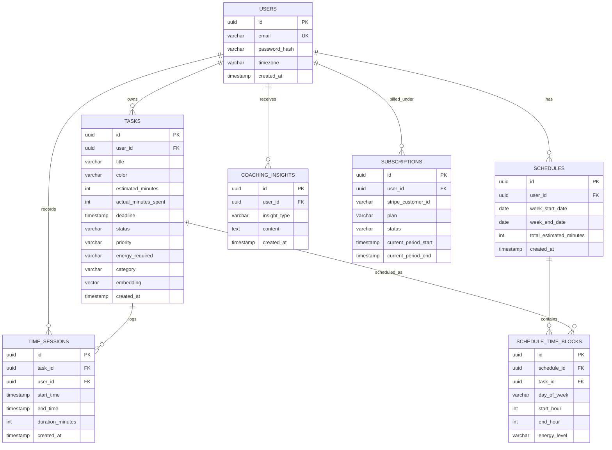

# Database Schema Diagram

## 1. Relational Entity Relationship Diagram

```mermaid
erDiagram
    USERS ||--o{ TASKS : owns
    USERS ||--o{ TIME_SESSIONS : records
    USERS ||--o{ SCHEDULES : has
    USERS ||--o{ COACHING_INSIGHTS : receives
    USERS ||--o{ SUBSCRIPTIONS : billed_under
    TASKS ||--o{ TIME_SESSIONS : logs
    SCHEDULES ||--o{ SCHEDULE_TIME_BLOCKS : contains
    TASKS ||--o{ SCHEDULE_TIME_BLOCKS : scheduled_as

    USERS {
        uuid id PK
        varchar email UK
        varchar password_hash
        varchar timezone
        timestamp created_at
    }

    TASKS {
        uuid id PK
        uuid user_id FK
        varchar title
        varchar color
        int estimated_minutes
        int actual_minutes_spent
        timestamp deadline
        varchar status
        varchar priority
        varchar energy_required
        varchar category
        vector embedding
        timestamp created_at
    }

    TIME_SESSIONS {
        uuid id PK
        uuid task_id FK
        uuid user_id FK
        timestamp start_time
        timestamp end_time
        int duration_minutes
        timestamp created_at
    }

    SCHEDULES {
        uuid id PK
        uuid user_id FK
        date week_start_date
        date week_end_date
        int total_estimated_minutes
        timestamp created_at
    }

    SCHEDULE_TIME_BLOCKS {
        uuid id PK
        uuid schedule_id FK
        uuid task_id FK
        varchar day_of_week
        int start_hour
        int end_hour
        varchar energy_level
    }

    COACHING_INSIGHTS {
        uuid id PK
        uuid user_id FK
        varchar insight_type
        text content
        timestamp created_at
    }

    SUBSCRIPTIONS {
        uuid id PK
        uuid user_id FK
        varchar stripe_customer_id
        varchar plan
        varchar status
        timestamp current_period_start
        timestamp current_period_end
    }
```
