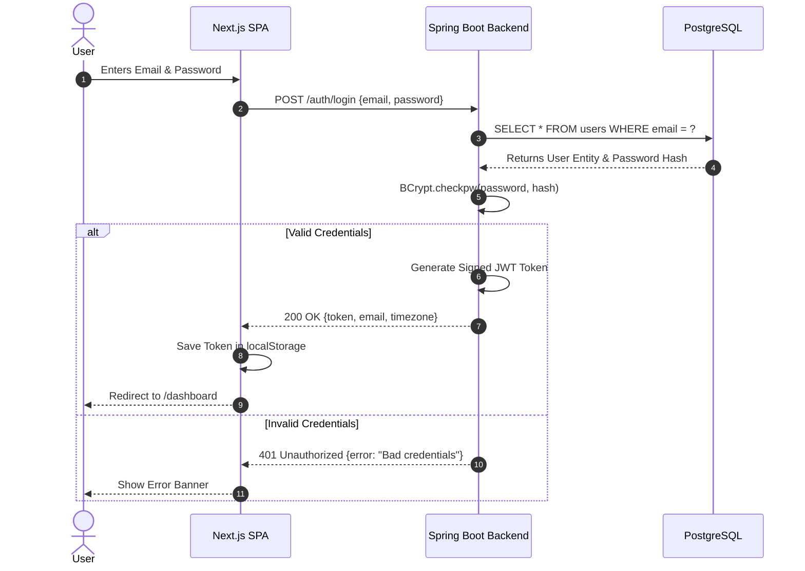

# Authentication Flow

## 1. Step-by-Step Description
1. User enters email and password at `/auth`.
2. Frontend sends `POST /auth/login` with JSON payload `{ email, password }` to Spring Boot.
3. Spring Security's `AuthenticationManager` validates credentials against `users` table via BCrypt comparison.
4. On success, `JwtTokenProvider` signs a JWT containing user email and expiration timestamp (default 24 hours).
5. Frontend receives token, stores it in `localStorage`, and attaches it to subsequent `Authorization: Bearer <token>` request headers.

## 2. Sequence Diagram

