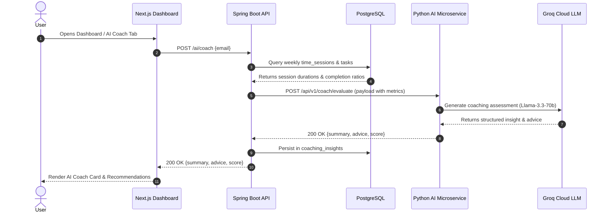

# Core Business Flow 2: AI Productivity Evaluation & Coaching

## 1. Flow Overview
Explains how user focus session history is analyzed by the AI engine to generate actionable recommendations.

## 2. Sequence Diagram

